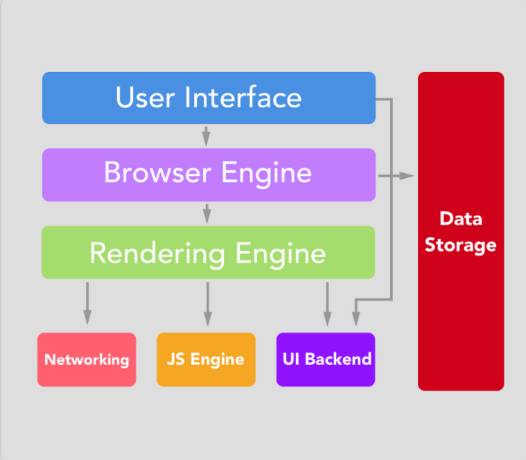
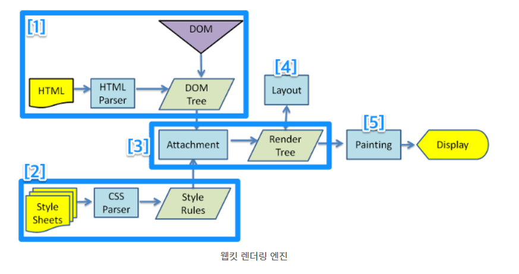
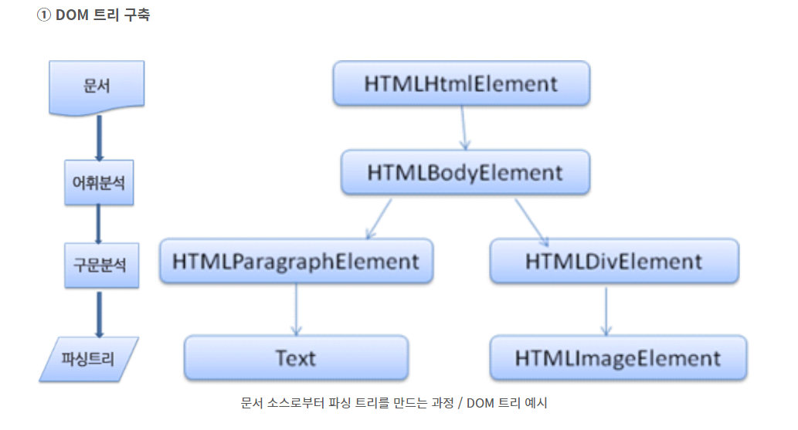
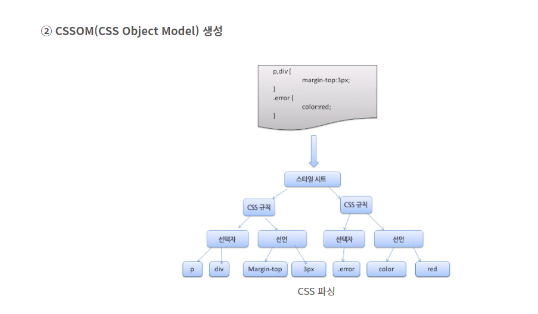
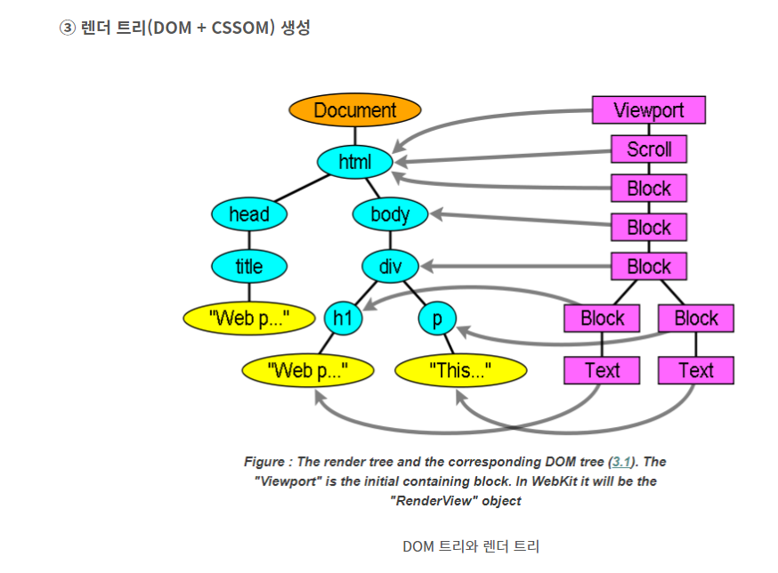

<h2>HTML</h2> 

<h3>1.HTML이 뭔데?</h3>

HTML은 Hypertext Mark Language의 줄임말로,

MDN에서의 소개말은 "웹을 이루는 가장 기초적인 구성 요소,
웹 콘텐츠의 의미와 구조를 정의할 때 사용한다."라고 한다.

이 HTML은 자바나 C같은 프로그래밍언어가 아니라는 점, 단순히 내용을 구조화 하기 위해, 
브라우저를 통해 웹페이지에 보여질 내용의 구조를 정의하는 언어이다.

간단하게 웹페이지를 구성하는 가장 기본적인 구성요소 혹은 우리가 스크립트나 CSS로 동작 혹은 스타일을 줘야할 대상 혹은 뼈대 라고 생각이 된다.  

그리고 Html을 조금이라도 해본 사람은 알겠지만, HTML의 풀네임 중 HyperText는 다른 페이지로 연결하는 링크를 말한다.  
가끔 보다보면 밑줄이 그어진 파란 글자를 생각하면 쉽다.

그리고 MarkUp은 웹 브라우저에 나타내줄 글이나 이미지 같은 내용들을 나타내주기 위한 사용하는데,  
```<footer> <div> <header>``` 등 꺾새(?) 안에 들어가있는 형태를 띄고 있는 태그들이고 꽤나 다양하다.
개중에는 존재는 하지만, 사용하지 않는 ```< frameset> < marquee>```등의 태그가 있기도 하기 때문에 
실질적으로 사용되는 태그가 따로 있으므로 다양하다고 해서 머리아파할 이유는 하등없다.

HTML의 요소는 위에서 말한 태그들을 사용해서 문서의 다른 텍스트와 구분이 된다고 하는데,
이 말은 <title> </title> 이 태그 사이에 들어오는 텍스트와 태그 바깥 부분 그리고 태그의 괄호 안에 들어있는 텍스트가
모두 다르게 작용될 수 있다는 것으로 생각하면 된다.

<h3>2. HTML 어떻게 사용하는건데?</h3> 
(* 내용은 문자일수도 있고 그림일 수도 있고, 여러형태이니 내용이라고 해서 본문글 처럼만 생각하지 않는것이 좋다.)

먼저 MDN 등 HTMl을 학습하거나 소개하는 사이트들이 요소 혹은 엘레멘트 (Elements)라는 단어를 게속 사용하는 것을 본적이 있을텐데,
HTML은 나타낼 내용을 부분만 감싸거나 씌우거나 하는 방식으로 보이거나 감추거나 혹은 스크립트로 동작하게끔 하는 대상을
"요소"라고 한다. 

예를 들어,
```" 웹 개발자가 되고 싶어용♥ " ```
이라는 문구가 있는데, 글자 크기를 변경 하고 싶다면  

```<h1> 웹 개발자가 되고 싶어용♥ </h1>``` 처럼 내용을 둘러싸면 된다.  

위의 1에서 마지막에 언급한 구분이라고 하면  

```<h1> 웹 개발자</h1>가 되고 싶어용♥```
과 같이하면 문장의 일부분만 변경되기도 한다.

태그로 내용을 감싸줄 때 태그를 닫는 순서라든지 하는 것은 몇 번 사용해보면 쉽게 알 수 있을 것이다.

잠깐 중요한 얘기를 하자면 
HTML에서 말하는 요소가 무엇인지 살펴보자면

```
<h1>         웹 개발자가 되고 싶어용♥         </h1>
<--->	      <-------------------->	    <---->
여는태그			내용		   닫는 태그
<-------------------------------------------------->
                           요소
```                           
순서대로 간단하게 설명하자면
'여는태그'는 요소의 이름으로 구성되고, 요소가 시작되는 곳, 스크립트나 css 같이 효과가 시작되는 곳이다.

'닫는태그'는 여는 태그와 쌍을 이루어서 같지만, 요소의 이름 앞에 전방향 슬래시가 포함된다는 점이 다른점이고, 요소의 끝을 나타낸다.

'내용'은 그냥 일반적인 텍스트나 그림이나 하는 내용을 말한다.

'요소' 그리고 위의 3가지로 구성된 것을 요소라고 한다.

또, 이 요소는 다음과 같이 속성도 가질 수 있다.

```<p class="editor-note">My cat is very grumpy</p>```

위의 예시에서 class="editor-note" 라고하는 부분이 해당 요소가 갖고 있는 속성 (Attribute)이다.
속성은 실제 컨텐츠로 표시되길 원치 않는 추가적인 정보를 나타낸다. 
예시에서처럼 class를 부여하면 이후 css로 스타일 혹은 스크립트 등에서 사용할 때 타겟팅 될 수 있게끔
식별자로 사용이 가능하다.

이 속성이 반드시 가져야할 것이 있는데, 요소이름, 속성 이름 뒤의 등호, 속성 값의 앞 뒤에 열리고 닫는 인용부호 ("또는 ')가 있어야 한다고 
소개되어 있고 그렇게 표기해야지만 식별자로 사용이 가능하다.
----
<h3> HTML 표준의 역사는 어떻게 될까요?</h3>
<h5> 먼저 표준에 대해서 왜 이야기하는지부터 이야기해보자. (-HTML 표준을 지키는 것은 왜 중요할까요?)</h5>
- 표준은 접근성과도 밀접한 관계를 가진다.  
일단 표준이 없다고 생각해보자, 브라우저의 종류를 보자면 크롬 파이어폭스 IE 엣지 웨일 오페라 등 여러개인데
표준이 없어서 각기 다른 화면, 다른 기능 등을 표현해준다고 생각해보면 생각보다 혼잡할 것 같다.  
이러한 이유들을 생각하면  접근성과 관계가 있다는 말이 자동으로 납득이 될 것이다.  
특히나 현재는 이전과는 다르게 브라우저의 다양성만이 아니라 모바일이나 태블릿 혹은 IOS, 안드로이드 등과 같이 디바이스, 운영체제도 다양하기 때문에 더욱 중요해지고 있다.  


- 검색 결과에도 영향이 올 수 있다고 한다.  
마크업 랭기지는 검색시에 메타 요소, 다른 말로는 Head 요소에 영향을 받아 정확한 문서정보의 제공이나 제목을 찾게 되는데,
누군가는 헤더를 이렇게 누군가는 저렇게 각기 다른 방식으로 사용하다보면 매번 검색 결과에 대한 정확도나 신뢰성이 떨어질 것이고, 이로 인해 기업은 마케팅 비용이 추가 된던지 할하는 경우도 생길 수 있겠지만,
표준에 맞추어 누구든지 표준에 충실한다면 검색을 실시하는 입장에서 혹은 검색을 당하는 입장에서 훨씬 큰 효율을 얻을 수 있을 것이라고 생각되는 부분도 있다고 생각해볼 수 있다.  
 나는 농구공을 사고 싶은데 누구는 축구공을 농구공이라고 하고 누구는 럭비공을 농구공이라고하면 과연 나는 어떻게 내가 생각하는 농구공을 찾을 수 있을 것인가?..


- 표준을 맞춤으로써 구조와 표현의 분리가 된다고 한다.  
이게 무슨 말이냐고 이전에는 하면 테이블을 레이아웃의 용도로 활용하는 등의 구조와 표현이 뒤섞인 방식이 많았다고 한다.  
무슨 말이냐고 하면 영역을 나누는게 아니라 누구는 테이블을 크게 짜서 테이블 셀안에 테이블을 넣는 등으로 페이지의 구조를 만들었다고 하는 것 같은데, 웹 표준 방법론에서는 구조는 HTML이나 XHTML 등의 마크업 언어를 구축하고, 디자인과 같은 표현 정보는 CSS를 이용함으로써 구조와 표현이 각각 독릭접으로 구분되어 구현 하도록 가이드를 제시하고 있다.


- 공통 기준, 표준이 제대로 서면 손쉬운 유지 보수에 대한 코스트가 적어진다.  
위에서 말한 것처럼 구조와 표현 등을 각기 분리해서 제작하다보면 유지 보수가 좀 더 용이해진다.  
어떻게 보면 당연한 이야기가 될 수 있지만, 얘기를 해보자면 독립되지 않고 여러개 섞여 있는 페이지나 시스템을 디자인만 리뉴얼 하려고 한다고 하면 이미 모두 한 곳에 섞여있어서 떼내는데도 시간이 오래 걸리거나 아예 재사용은 꿈도 못 꾸는 경우도 있을 수 있다.  
하지만 분리가 되어 있는 경우라면 구조가 되는 마크업은 그대로 다시 사용하되 스타일 시트만 손을 보면 될 일인 것이다. 추가로 서버의 경량화로 인해 트래픽 비용이 감소하는 추가 효과도 있을 수 있다고하니 고려대상이 아닌 필수 사항이다.  
추가로 확장성이나 호환성에서도 유지보수가 쉬우니 장점으로써 덤으로 따라올수 있다.


이 정도면 충분히 왜 표준을 지켜야하는지 충분히 설명이 됐으리라 생각한다.


<h2> 자, 이제 표준이 왜 필요한지 알았으니 대략적인 HTML 표준 역사를 확인해보자</h2>

<h3>1. 1980년 물리학자 '팀 버너스리'가 HTML의 원형이었던 인콰이어를 제안했다.</h3>  

이는 원래 CERN이라는 유럽 입자 물리 연구원들이 문서를 이용하고 공유하기 위한 체계였고, 이 후 1989년에는 인터넷 기반 하이퍼텍스트 체계를 제안하는 메모를 작성했다.  버너스리는 2년 뒤 1190년에 HTML을 명시하고 브라우저와 서버 소프트웨어 만들었었다고 한다.


이렇게 HTML이 최초로 일반에 공개되었던 1990년 HTML태그 라고 부르면서 "최초규격"이 시작되었다고 한다.

이 때 당시엔 머릿글자로 이루어진 20개의 요소로 기술하는 단순한 디자인에 그쳤었다고 한다.

<h3>2. 이후 95년  HTML 2.0이 국제 인터넷 표준화 기구(IETF) RFC 으로 발표된다.</h3>
(*RFC는 Request for Comments의 약자로 비평을 기다리는 문서라는 의미로 컴퓨터 네트워크 공학 에서 인터넷 기술에 적용 가능한 새로운 연구 등을 아우르는 메모를 나타낸다. 일련번호로 표기되고 1866이 그 해당 일련번호이다. 크게 의미 없을 수 있으니 그런 일련번호를 가진 문서구나 정도로 넘어가자.)  

HTML 2.0 에서의 내용들
- [ **양식 기반 파일 업로드** 1995년 11월 25일 ](https://datatracker.ietf.org/doc/html/rfc1867)
- [**테이블** 1996년  5월 ](https://datatracker.ietf.org/doc/html/rfc1942)
- [**클라이언트 측 이미지 맵** 1996년 8월](https://datatracker.ietf.org/doc/html/rfc1980)
- [**국제화** 1997년 1월 ](https://datatracker.ietf.org/doc/html/rfc2070)  

하지만 위의 내용들은 2000년 부터 더 안 쓰이고, 역사적인 것으로 선언되었다고 한다. 

<h3>3. HTML3.2가 W3C권고안으로 발표. 97' 1월</h3>
- 96년도 9월에 폐쇄한 HTML 작업 그룹인 IETF와 같이 W3C에 의해 배타적으로 개발되고 표준화된  첫 번째 버전이라고 한다.
- HTML 3.2 에서 여러 종류의 겹치는 확장 수학 수식을 완전히 제외 시키고   
넷스케이프 ( 이전에 등대모양 아이콘을 가진 브라우저)의 비주얼 마크업 태그의 대다수를 채택한다.  
하지만 넷스케이프의 블링크 요소와 Ms의 마퀴 요소는 누락된다.   
<h6>(그리고 HTML에서의 수학적 수식과 비슷한 마크업은 이후 MathML이 나올 때까지 14개월 동안 표준이 아니었다고 한다.</h6> 
<h6>(MathML은 XML 응용중 하나로 수학 수식을 표현하고 구조와 내용을 파악하기 위한 마크업 언어라는데  아직은 사용해본적이 없다.)</h6>

<h3>4. HTML 4.0     W3C권고안으로 발표. 97' 12월</h3>  
이 W3C 권고안으로 출시되었다. HTML 4.0은 세가 가지 문서 형태를 제공한다.
- Strict(엄격) : 사용이 중지된 요소를 금지한다. ('use strict'를 떠올리면 된다.)
- Transitional(변이) : 사용이 중지된 요소를 허용한다.
- Frameset(프레임셋) : 대부분 프레임 관련 요소에서만 허용한다.  
 
 그리고 이시기에 넷스케이프의 시각적 마크업 기능을 단계적으로 걷어내기로 한다.  
 4.0은 98' 4월까지 조금씩 수저오디어 재발표 된다.
  
<h3>5. HTML 4.01 W3C 권고안으로 발표 99' 12월</h3>
- HTML 4.0과 마찬가지로 세 가지 문서 형태를 제공하고 최종 오류 수정 사항이 발표된다.
- XML 기반 병렬 개발 언어인 XML 기반 병렬 개발 언어인 XHTML을 통해 W3C의 HTML 작업 그룹이 성장했다고 한다.

<h3>6. HTML 08' 01월  HTML 초안 작업은 W3C에 의해 발표</h3>
- 문법은 SGML(HTML의 근본이될 수 있는 )의 문법과 아주 밀접하지만, HTML5는 난해한 SGML문법과 이별한다.
- HTML HTML4.01, XHTML 1.0, DOM 레벨2  HTML에 대한 차기 표준 제안인데, 비디오, 오디오 등 웹에서 할 수있는 다양한 부가기능이나 최신 멀티미디어 콘텐츠를 액티브 X없이 블아ㅜ저에서 쉽게 볼 수 있게 하는 것을 목적으로 한다.
초안이 08'에 나왔지만 14년도 10월에 표준안을 확정했다고 발표된다.
- HTML 4와 차이점으로 잠깐 설명하자면 
  - 요소 추가
    - 구조적인 요소와 구역을 나누는 블록 요소인 div요소를 대신한다.
      - header
      - nav
      - article
      - section
      - aside
      - footer
    - 멀티미디어 요소 - 플러그인 없이 멀티미디어를 재생할 수 있게 한다.
      - audio - 오디오를 재생한다.
      - video - 비디오를 재생한다.
      - canvas  
    - command
    - datalist
    - details
    - embed
    - figure
    - figcaption
  - 요소 의미 변경
    - em 
    - hr  
  - 문서 선언 <!DOCTYPE html>으로 간소화 되었다. (대소문자 구분 안함)
  - 요소 제거  
    - 비슷한 기능의 다른 태그로 대체 가능한 태그들 - acronym, applet, dir, isindex
    - 디자인적인 기능 이상의 의마가 없어 삭제(CSS로 대체 가능한 태그들) - basefont, big, center, font, strike, tt
    - 웹 접근성 향상을 위해 사용을 지양하는 태그들 -frame, frameset, noframes
    
정도로 보면 될 것 같다.

<h2> 그럼 XHTML은 무엇인가?</h2>

위에서 XML이라던지 XHTML을 언급한 것이 보았을텐데,   
<h3>XML이란</h3> 
eXtensible markup Language는 W3C에서 개발된, 다른 특수한 목적을 갖는 마크업 언어를 만드는데 사용하도록 권장하는 마크업 언어이다.
이름의 eXtensible에서 알 수 있듯이 확장성을 위한 위한 다목적 언어라고 봐도 될것 같다.  
XML은 주로 다른 종류의 시스템, 특히 인터넷에 연결된 시스템끼리 데이터를 쉽게 주고 받을 수 있게 하여 HTML의 한계를 극복할 목적으로 만들어졌다고 한다.
HTML 한계를 극복하려는 목적으로 만들어졌다.  
W3C가 만든 XML 1.0Specification과 몇몇 다른 다른 관련 명세들과 모든 자유 개방형 표준에서 정의되었다.

W3C는 XML 설계 목표에서 단순성과 일반성, 그리고 인터넷을 통한 사용 가능성을 강조했다고 하는데, 결국은 HTML이 못하는 것을 구현하고 그 기능을 확장하기 위해 만들어진 마크업 언어인 것이다.

<h5>XML의 기본개념</h5>

- Standard Generalized Markup Language (이하 SGML) 은 문서용 마크업 언어를 정의하기 위한 메타 언어라고 하는데, 
IBM에서 개발한 GML의 후속이며, ISO 표준이라고 한다.
- XML은 HTMl과 마찬가지로 마크업 언어이다.  
XML이 HTML과 다른점은 데이터를 보여주는 목적이 아닌 데이터 저장과 전달 목적이고, XML태그는 HTML처럼 미리 정의가 되는 것이 아닌 사용자정의가 가능하다는 점도 있다. 이와 같은 이유로 이종간의 시스템사이에서도 데이터를 손쉽게 교환할 수 있도록 해준다고한다.
사용자 정의 태그가 사용 가능하기 때문에 확장성이 좋고, 텍스트 데이터 형식의 언어로서 모든 XML문서는 유니코드 문자로만 이루어지게 된다.

<h3> 그럼 XML이랑 HTML 이 합쳐지면 XHMTL인가?</h3>
- XHTML은 Extensible HTML을 의미한다. HTML과 보기에 비슷해 보이지만 문법적용이 좀 더 엄격하다.


- 그럼 엄격한게 더 좋은거라서 XHTML을 쓰는건가?  
    - 위의 표준화에서도 얘기했듯이 다양한 플랫폼 다양한 디바이스 등 워낙 여러 방면으로 웹을 사용하는데에 비해 HTML 문법을 지원하는 데 필요한 자원이 부족한 경우가 점진적으로 늘어났고,  
    XHTML문서는 하나의 XML문서로서 문법적으로 정확하기에 사용하는 것이 문제 방지에 도움이 되기도 하고, 표준 XML 라이브러리를 이용한 자동화된 처리가 가능해진다고 한다.

    
- 근데 HTML5가 나왔는데 XHTML이 뭐가 달라서?  
 HTML1.0은 HTML5가 나오기 이전의 가장 최신의 HTML 문서 규격인데, HTML5는 단순히 4에서 버전업만 한 것이 아니라, XML애플리케이션과 호환성을 예상하고 만든 언어라서 프로그래밍 언어가 아님에도 불구하고 프로그래밍 언어처럼 동작하는 것이라고 한다.


- 또 한가지 아이러니한 부분이 있는데, XHTML 1.0 이전 버전의 HTML은 태그를 닫지 않아도 동작할 수 있게 만드는 느슨한 언어라면 XHTML1.0은 정교한 프로그래밍 언어와 같은 방식으로 동작했다고 보면 될텐데, HTML5이후로는 다시 이전처럼 HTML처럼 느슨하게 프로그래밍을 해도 동작을 한다.  
이유는 코드를 보다 적게 사용한다고 해도 브라우저에서 모든 태그를 인식하게 하여 태그가 적어지면 웹페이지들의 크기도 작아지기 때문에 동작이 빨라짐을 위함이라고 한다.

<h3> XHTML 2.0은 왜 세상에 나오지 못하게 되었을까요?</h3>  
말하기에 앞서 XHTML2.0은 XHTML1.0, XHTML1.1은 전혀 다르다.  
HTML1.0의 경우 HTML4를 XML 문법으로 변경한 것이고, 1.1은 1.0에서 XML 문서 형식으로 제공하는데에 비해서 XHTML 2.0은 HTML4와 아무런 관련이 없는 순수한, 오리지날리티한 태그 용어를 만들려고 했던 새로운 시도였기 때문이다.  

<h6>그게 무슨 문제가 될까?</h6>
호환성에 대한 문제 제기가 계속 된다.
 추가로 HTML5에서는 XHTML 문법처럼 엄격모드와 HTML문법을 모두 제공하고 있다.
즉 문서를 application/xhtml+xml 형태로 제공하게 되면 HTML5에 충실한 문서가 된다는 것이다.  
XHTML 2.0의 경우 하위 호환이 전혀 이루어지지 않는 반면,  
HTML5의 경우에는 문서 선언부에  
```<!DOCTYPE html PUBLIC"..//W3C//DTD XHTML 1.0 Strict//EN" "http://www.w3.org/TR/xhtml1/DTD/xhtml1-strcit.dtd">``` 를 ```<!DOCTYPE html>``` 로 변경 하면 된다. 

결론적으로 2.0은 호환성이 떨어지는 독자적인 성격 때문에 종료되었다고 볼 수 있다.

<h3>HTML5 표준은 어떤 과정을 통해 정해질까요?</h3>
WHATWG와 W3C를 주축으로 HTML5 표준을 진행하고 있다고 한다.
이들 단체, 혹은 기구가 필요한 이유는 브라우저나 구동이 되는 SW가 있거나 구동이 되지 않는 SW가 있을텐데, 웹문서라고 그러지 않으리란 법은 없다. 그렇기 때문에 이를 규격화 하려고 하는 노력을 기할 수 밖에 없는데, 그 목적을 위해서 설립된 기관이 웹 표준 기관 WHATWG이다.  
이 WHATWG에는 모질라재단이나 애플 오페라 소프트웨어등 의 갱니들이 모여 설립하고 이후에 구글도 참여하게 되었다고 한다.

<h2>브라우저의 역사는 어떻게 될까요?</h2>
<h3> 1. Internet Explorer가 브라우저 시장을 독점하면서 어떤 문제가 일어났고, 이 문제는 어떻게 해결되었을까요?</h3>
우선 IE는 95'에 출시하여, 브라우저 시장을 선점하고 있던 넷스케이프 Navigator를 추격할 2가지 전략을 갖고 있었는데, 하나는 IE의 성능 혁신 이고 하나는 MS의 Os, 윈도우 독점을 활용하는 것이었다고 한다.  
첫번째 전략이었던 성능혁신은 당시 업데이트 주기를 보면 알 수 있는데, 95' 8월, 95' 11월 , 96' 8월 , 97' 9월이라는 점만 봐도 알 수 있었다, 하지만 이 이렇게 빠르고 짧은 업데이트 주기만큼 점유율에 영향을 주진 못했었지만, 최초로 CSS를 구현하는등 이미지만 쌓아가고 있었다.  


하지만 OS 시장을 독점하고 있던 윈도우에 기본적으로 장착하는 전략은 당시 넷스케이프의 유료화 정책에 물리면서 점유율을 끌어올리는데 성공는 포인트가 되었다.  
당시 IE의 점유율은 90%이상을 상회한다고 한다.

하지만 이 두번째 전략이었던 Os에 기본장착 하는 방식은 EU가 독점으로 지적하면서 브레이크를 걸어왔고, 미국에서도 독점 판정을 받게되면서 ms는 독점 판정 받은 이후 판결을 이행할 수 밖에 없었다고 한다.  
하지만 이미 90%이상의 점유율을 보유 하고 있었고, 이에 자만한것인지 알수는 없지만  Ms는 2001년 8월 버전6을 출시 후에 ie의 추가적인 개발을 거의 중단 하다시피 했다고 한다.  
5년간 2번의 서비스 팩 업데이트 외에 기능개선은 없었고, 실제로도 ms 내부에서 버전6 이후 IE 개발팀을 해체했다고 한다.  


그렇게 독점으로 인한  장기간 브라우저의 발전은 없는 시기가 있었고, 2007년에 아이폰이 처음으로 출시되고 스마트폰을 선두로한 모바일 디바이스 시대가 오면서  앱 브라우저 시장에도 옇양을 끼치게 된다.


하지만 이럼에도 불구하고 Ms는 이러한 흐름 또한 무시하면 모바일 브라우저에 신경도 쓰지 않았다.


이에 IE가 쇠퇴가 본격적으로 가속화되었다고 보고 있는데, 이에 추가로 Ie 운영정책이 소비자 지향적이지 않다는 점과 보안 문제에 대응하지 않는 등의 태도가 있었다고 한다.

독점으로 인해 브라우저의 발전 저해와 경쟁이 없자 지원이 끊어버린 상황임에도 불구하고 선택권이 없던 점등이 큰 문제로 지목되어 SW 독점을 경계하는 계기가 되었다고도 한다.

<h3> 2. 현재 시점에 브라우저별 점유율은 어떻게 될까요? 이 브라우저별 점유율을 알아보는 것은 왜 중요할까요?</h3>

(보통 스탯 카운터와 넷카운터를 주로 인용하는 것으로 알고 있어, 넷카운터를 인용하기로 한다.)

현재 21' Oct 기준으로 크롬이 64.67%, 사파리가 19.06%, 엣지가 3.99%, 파이어폭스가 3.66% 삼성 인터넷이 2.81 오페라가 2.36%로 확인된다.

브라우저별 점유율을 알아보는 것이 중요한 이유는 간단하다, 브라우저 별로 지원하는 기능이 다 다른데, 개발 환경, 그리고 작업 과정에서 호환성에 대해서 고민해보고 방향을 잡을 수 있다. 서비스를 준비하고 시행하는 입장에서 시장성에 대해서 고민도 해볼 수 있는 지표가 되기 때문이다. 

<h3> 3. 브라우저 엔진(렌더링 엔진)이란 무엇일까요? 어떤 브라우저들이 어떤 엔진을 쓸까요?</h3>

우선 브라우저의 구성 요소를 간단히 도식화해서 설명하자면




형태라고 보면 되는데, 브라우저마다 상이할 수 있다.

- UserInterface 는 사용자가 접근할 수 있는 검색창, 뒤로가기 /앞으로가기 등의 GUI 구성 부분이다.


- Rendering Engine : 요청한 콘텐츠를 화면에 출력하는 역할이다.  
 HTML 이나 CSS등을 파싱하여 최종적으로 화면에 그린다.

- Browser Engine : User Interface와 Rendering Engine 사이의 동작을 제어해주는 엔진이다.  
브라우저라는 프로그램의 비즈니스 로직, 핵심 중추 부분이다.  
Data Storage를 참조하며 로컬에 데이터를 쓰고 읽으면서 다양한 작업을 한다.


- Networking : http 요청을 할 수 있으며 네트워크를 호출할 수 있다.


- JS Engine : javaScript 코드를 해석하고 실행한다.


- UI Back End : 기본적인 위젯을 그리는 인터페이스 이다.

- Data Storage : Local Storage, Indexed DB, 쿠키 등 브라우저 메모리를 활용하여 저장하는 영역이다.


이 중에서 질문의 주재였던 렌더링 엔진에 대해서 조금 더 설명을 해보자.

- 렌더링 엔진의 기본적인 동작 원리  
 DOM트리 구축 위한 파싱 -> 렌더 트리 구축 -> 렌더 트리 배치 -> 렌더 트리 그리기
  1. 브라우저는 서버로부터 HTML 문서를 모두 전달 받는다.
  

  2. 렌더링 엔진은 전달받은 HTML 문서 파싱하여 DOM 트리를 구축한다.  


  3. 외부 CSS 파일과 스타일 요소를 파싱한다.


  4. DOM 트리와 3번과정 결과물을 합쳐서 렌더 트리를 구성한다.


  5. 렌더 트리의 각 노드에 대해서 화면 상에서 어디에 배치할 지 결정한다.


  6. UI백엔드에서 렌더 트리를 그리게 되고, 화면에 우리가 볼 수 있도록 출력된다.
  
   가장 처음의 설명대로 파싱 - DOM트리 구축 - 렌더트리 구축 - 렌더링 의 4과정으로 생각해도 무난하다.
    


위의 그림이 렌더링 엔진의 동작 과정 예시이다.
언급한대로 렌더링 엔진은 브라우저마다 다를 수 있고 다양하기 때문에 모두 똑같다고 보면 안되고 , 예시로서만 확인 해보자.

- 돔트리 구축 단계를 아래에서 도식으로 확인 해볼 수 있다. 



- 브라우저는 서버로부터 HTML문서를 모두 전달을 받게 된다.
- 이 중에서 어휘와 구문을 분석하며 HTML문서를 파싱하고, 파싱 트리를 생성한다.
- 파싱 트리를 기반으로 DOM요소와 속성 노드를 가지는 DOM트리를 생성한다.  
  (문서 파싱은 말 그대로 코드릴 이해하고 사용할 수 있는게끔 읽고 변환한다는 뜻이다.)


  아래는 CSSOM , CSS Object Model 생성 이다.

- 위에서 DOM트리를 생성할때와 같다.(받아서 파싱하고, 파싱한걸로 트리 생성하고 트리기반으로 또 CSS트리 생성하고)
- 그 결과로 브라우저가 이해할 수 있는 Style Rule로 변환이 된다.



- DOM TREE가 구축되어 가는 동안 브라우저는 DOM TREE를 기반으로 렌더트리를 또 생성하는데, 시각적 구성을 위한 요소로 만들어 준다.


- 그리고 다음으로는  
렌더 트리 배치를 하게 된다. 렌더링 트리는 위치와 크기를 가지고 있지 않기 때문에, 객체들에게 위치와 크기를 결정해주도록 한다.

- 렌더 트리 그리기 렌더 트리의 각 노드를 화면의 픽셀로 나타내지면 화면에 출력이 된다.

<h3>4. 모바일 시대 이후, 최근에 출시된 브라우저들은 어떤 특징을 가지고 있을까요?</h3>

  일단 모바일 웹이 HTML 기반의 웹 브라우저로 동작한다. PC웹과의 큰 차이점은 화면의 사이즈가 작고, 터치 스크린의 인터페이스를 가지며 'Click-to-Call'과 같은 모바일에 특화된 기능을 제공하는 등, 모바일 디바이스에 특화되어서 나오는 웹인데, 그렇기 때문에 반응형 웹과 적응형 웹이 나뉘어지는 등의 변화가 일어난 것 같고, 디바이스 마다 다른 브라우저의 크기에 맞게 웹페이지의 크기가 변경되는 방식이다.
반응형 웹의 경우 적응형 웹과 달리 한 페이지, 원소스로 관리 되기 때문에 유지 보수가 편리하고 1번만 수정하면 되는 등의 이점을 갖고 있다.  
요점은 모바일, 태블릿 같은 디바이스들이 나오면서 각각의 화면에 맞는 처리를 해서 출력해야하기 때문에 반응형 웹 같은 것을 운영하는데에 있어서 특징이 있다.


#HTML 문서는 어떤 구조로 이루어져 있나요?
HTML의 기본 구조로 간략하게 자면  
```<!DOCTYPE html>``` : 현재 문서가 HTML5 문서임을 명시한다.  

```<html>``` : HTML 문서의 루트(root)요소를 정의합니다.  

```<head>``` : HTML 문서의 메타데이터(metadata)를 정의합니다.  
- 메타데이터는 HTML 문서에 대한 정보(data)로 웹 브라우저에는 직접적으로 표현되지 않는 정보를 의미합니다.
- 이러한 메타데이터는 ```<title>,<style>,<link>,<script>,<base>``` 태그 등을 이용하여 표현할 수 있다.  

```<title>``` : HTML문서의 제목(title)을 정의하며, 다음과 같은 용도로 사용됩니다.
  - 웹 브라우저의 툴바에 표시된다.
  - 웹 브라우저 즐겨찾기에 추가가 되는 제목이다.
  - 검색 엔진의 결과 페이지에 제목으로 표시된다.

```<body>``` : 웹 브라우저를 통해 보이는 내용(Content) 부분 입니다.

```<h1>~<h6>``` : 제목(heading)을 나타냅니다.

```<p>``` : 단락(paragraph)을 나타낸다. 

정도로 기본 구조를 보고 넘어가자.

<h3>```<head>```에 자주 들어가는 엘리먼트들은 어떤 것이 있고, 어떤 역할을 할까요?</h4>
위의 기본 구조에서 얘기했듯이 해당 문서의 메타데이터를 정의하고, 웹 브라우저에 표시되는 영역이 아니다.
```<title>,<style>,<link>,<script>,<base>```등이 있고 외부 참조라던지 문서의 제목 혹은 링크되는 참조사이트 등을 명시하는 영역이다.

<h3>시맨틱 태그는 무엇일까요?</h3>
시멘틱이라는 단어가 "의미의 혹은 의미론적인 "이라는 뜻이라고 한다.  
의미있는 태그를 제공하겠다는 이야기가 되는데,  
무엇이 의미가 있는 태그인가에 대해서 이야기 해보자면 

```<div>```의 경우 non-semantic 이라고 할 수 있지만,  
```<table>, <article>```의 경우에는 semantic 하다라고 할 수 있다.

무슨 차이일까 ?  

```<div>``` 의 경우 id나 class 없이 이 태그의 의미만 봐서는 내용을 유추할 수 없다.  
하지만```<table>``` 같은 경우에는 어느정도 어떤 내용들이 있을지 유추가 가능하다는 점이 차이가 있다.  
그래서 ```<header>```나 ```<footer>```처럼 이전에는 ```<div>``` 태그처럼 블럭영역으로 잡고 정의를 해주었던 것을 태그로서 제공 되는 것이 시멘틱 태그이다.

<h3>시맨틱 엘리먼트를 사용하면 어떤 점이 좋을까요? </h3>
위에서 언급한 표준화와도 어느정도 관련이 있다.  
```<div>``` 와 같은 태그 안에 id나 class속성으로써 개발자들의 각 주관으로 지정한 이름이기 때문에 검색엔진이 분석할때 식별이 조금 어려울 수 있다는 점이다.  
그 때문에 HTML5 에서는 정해진 시맨틱 태그를 사용하기로 했다고 한다.

<h3>블록 레벨 엘리먼트와 인라인 엘리먼트는 어떤 차이가 있을까요?</h3>
HTML의 모든 요소는 해당 요소가 웹 브라우저에 어떻게 표현되는지에 대한 display속성을 갖게 된다. 대부분은 Block과 InLine 둘 중 하나를 갖게 되는데,  

Block 타입의 경우엔 언제나 새로운 라인에 시작되고 해당 라인의 모든 너비를 차지한다, 즉 세로로 생성되고 해당 가로에는 한 요소만 있을 수 있다.라는 얘기다.

InLine 타입의 경우엔 새로운 라인에서 시작하지도 않고, 요소의 너비도 해당 너비 전체가 아닌 딱 요소의 내용만큼만 차지 한다는 특징이 있다.


